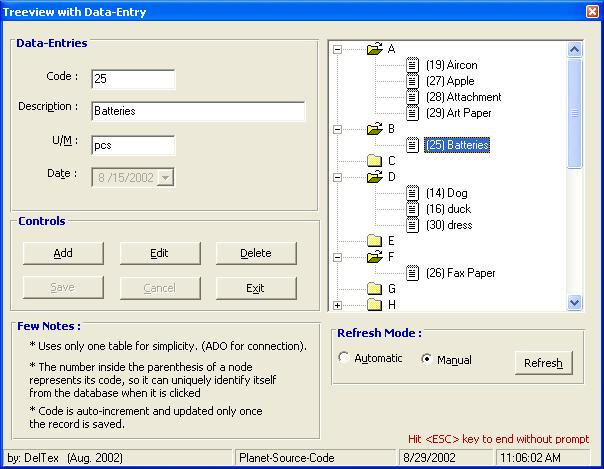



## ADO Database Data\-Entry and Treeview

### Description

Demonstrates how to add, edit, delete records in a database. Uses ADO for connection. Treeview is included to view the records alphabetically. User has the option if he wants Automatic treeview refresh or manual (see option buttons in snapshot above). NOTE: This is for real beginners.
 
### More Info
 

             |
---                |---
**Submitted On**   |2002-08-29 11:28:14
**By**             |[delTex](https://github.com/Planet-Source-Code/PSCIndex/blob/master/ByAuthor/deltex.md)
**Level**          |Beginner
**User Rating**    |4.7 (28 globes from 6 users)
**Compatibility**  |VB 6\.0
**Category**       |[Databases/ Data Access/ DAO/ ADO](https://github.com/Planet-Source-Code/PSCIndex/blob/master/ByCategory/databases-data-access-dao-ado__1-6.md)
**World**          |[Visual Basic](https://github.com/Planet-Source-Code/PSCIndex/blob/master/ByWorld/visual-basic.md)
**Archive File**   |[ADO\_Databa1241248292002\.zip](https://github.com/Planet-Source-Code/deltex-ado-database-data-entry-and-treeview__1-38456/archive/master.zip)

